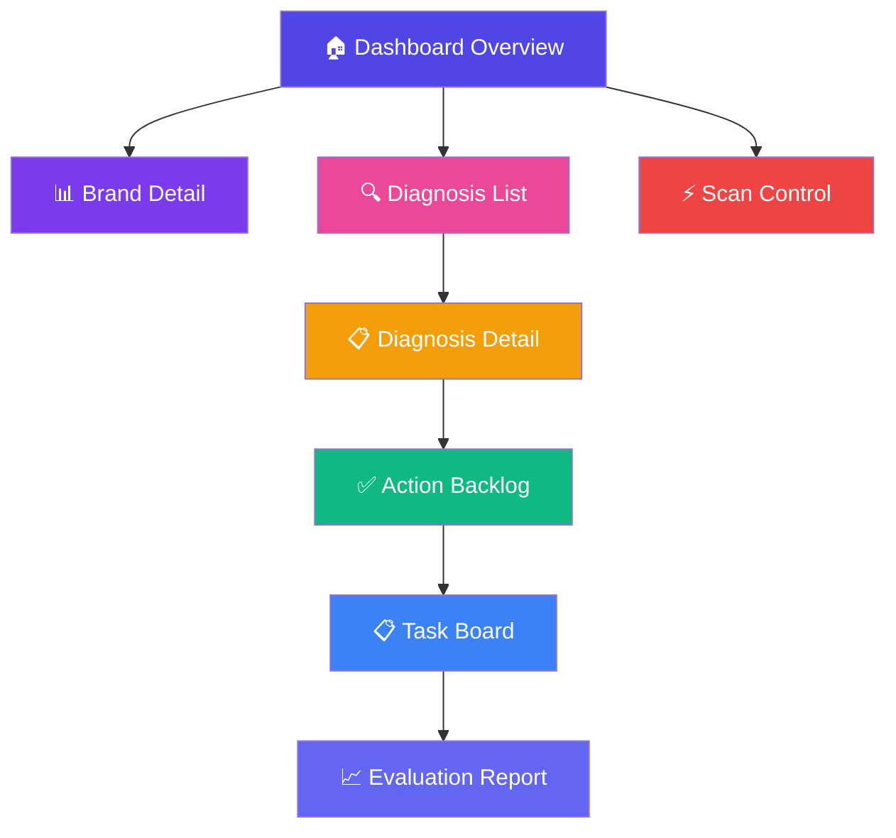
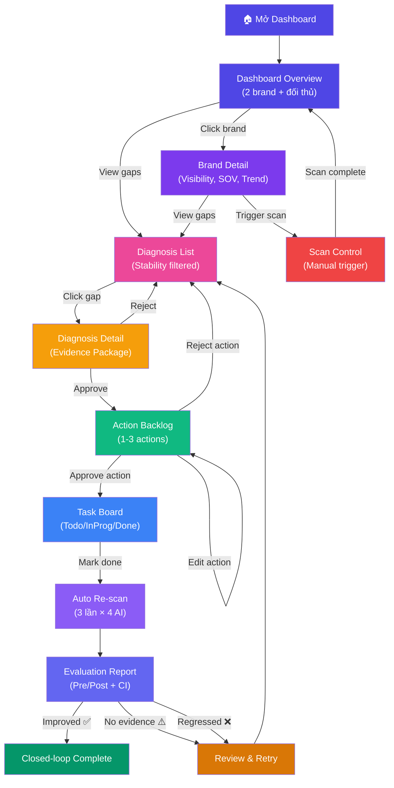

# 🎨 WIREFRAME / UI FLOW — GEO AI Agent cho E-commerce Việt Nam

> **Gate 1 Deliverable** · Phiên bản 1.0 · Ngày 02/08/2026
> **Phụ trách chính:** Hải (Frontend/Infra)
> **Tech Stack:** Next.js 14 + Tailwind CSS + Recharts

---

## MỤC LỤC

1. [Tổng quan Navigation](#1-tổng-quan-navigation)
2. [Sitemap](#2-sitemap)
3. [UI Flow Diagram](#3-ui-flow-diagram)
4. [Screen 1: Dashboard Overview](#4-screen-1-dashboard-overview)
5. [Screen 2: Brand Detail](#5-screen-2-brand-detail)
6. [Screen 3: Diagnosis List](#6-screen-3-diagnosis-list)
7. [Screen 4: Diagnosis Detail](#7-screen-4-diagnosis-detail)
8. [Screen 5: Action Backlog / Task Board](#8-screen-5-action-backlog--task-board)
9. [Screen 6: Evaluation Report](#9-screen-6-evaluation-report)
10. [Screen 7: Scan Control](#10-screen-7-scan-control)
11. [Responsive Design](#11-responsive-design)
12. [Design System](#12-design-system)
13. [User Flow Scenarios](#13-user-flow-scenarios)

---

## 1. Tổng quan Navigation

### 1.1. Top Navigation Bar

```
┌──────────────────────────────────────────────────────────────────┐
│  🛒 VN-ECOM-GEO    │ Dashboard │ Diagnosis │ Tasks │ Reports │  │
│                     │           │           │       │         │  │
│                     │           │           │       │    [⚙]  │  │
└──────────────────────────────────────────────────────────────────┘
```

### 1.2. Sidebar (khi mở)

```
┌─────────────────────┐
│ 🛒 VN-ECOM-GEO     │
│                     │
│ 📊 Dashboard        │
│   ├─ Overview       │
│   └─ Brand Detail   │
│                     │
│ 🔍 Diagnosis        │
│   ├─ Gap List       │
│   └─ Detail         │
│                     │
│ ✅ Tasks             │
│   ├─ Backlog        │
│   └─ Board          │
│                     │
│ 📈 Reports          │
│   ├─ Evaluation     │
│   └─ Export PDF     │
│                     │
│ ⚙ Settings          │
│   ├─ Brands         │
│   ├─ Prompts        │
│   └─ Scan Config    │
└─────────────────────┘
```

---

## 2. Sitemap



---

## 3. UI Flow Diagram

### 3.1. Main User Flow



---

## 4. Screen 1: Dashboard Overview

### 4.1. Wireframe

```
┌──────────────────────────────────────────────────────────────────────────────┐
│  🛒 VN-ECOM-GEO Agent         [Dashboard] [Diagnosis] [Tasks] [Reports] [⚙]│
├──────────────────────────────────────────────────────────────────────────────┤
│                                                                              │
│  ┌─ Summary Cards ─────────────────────────────────────────────────────────┐ │
│  │                                                                         │ │
│  │  ┌──────────────┐  ┌──────────────┐  ┌──────────────┐  ┌─────────────┐ │ │
│  │  │ 📊 Brands    │  │ 🎯 Avg       │  │ ⚡ Stable    │  │ 🚨 Alerts  │ │ │
│  │  │    2 target  │  │ Visibility   │  │ Gaps         │  │    3 new   │ │ │
│  │  │    4 comp.   │  │   42.5%      │  │   28/45      │  │ (giá/ship) │ │ │
│  │  │              │  │   ▲ +5.2%    │  │   62.2%      │  │            │ │ │
│  │  └──────────────┘  └──────────────┘  └──────────────┘  └─────────────┘ │ │
│  └─────────────────────────────────────────────────────────────────────────┘ │
│                                                                              │
│  ┌─ Filters ───────────────────────────────────────────────────────────────┐ │
│  │  Brand: [All ▼]   Prompt Group: [All ▼]   AI Engine: [All ▼]   [Scan] │ │
│  └─────────────────────────────────────────────────────────────────────────┘ │
│                                                                              │
│  ┌─ Visibility Rate by Brand ──────────┐  ┌─ SOV by AI Engine ────────────┐ │
│  │                                      │  │                               │ │
│  │   100% ┤                             │  │    ChatGPT  [===█===]         │ │
│  │    80% ┤      ╭──╮                   │  │    Gemini   [==█====]         │ │
│  │    60% ┤  ╭──╮│  │╭──╮              │  │    Claude   [====█==]         │ │
│  │    40% ┤──│  ││  ││  │──╮           │  │    Tavily   [=█=====]         │ │
│  │    20% ┤  │  ││  ││  │  │           │  │                               │ │
│  │     0% ┤──┴──┴┴──┴┴──┴──┴──         │  │  ■ Minh Long  ■ Lock&Lock    │ │
│  │        ML  L&L Sun Kan Phi Tef      │  │  ■ Sunhouse   ■ Kangaroo     │ │
│  │                                      │  │  ■ Philips    ■ Tefal        │ │
│  └──────────────────────────────────────┘  └───────────────────────────────┘ │
│                                                                              │
│  ┌─ Visibility Trend (30 ngày) ────────────────────────────────────────────┐ │
│  │                                                                         │ │
│  │   50% ┤         ╭──╮    ╭──────╮                                       │ │
│  │   40% ┤    ╭────╯  ╰────╯      ╰──────── Minh Long                    │ │
│  │   30% ┤────╯                                                           │ │
│  │   20% ┤──────────────────────────────────── Lock&Lock                  │ │
│  │   10% ┤                                                                 │ │
│  │       ┴───┬───┬───┬───┬───┬───┬───┬───┬                                │ │
│  │          W1  W2  W3  W4  (tuần)                                        │ │
│  └─────────────────────────────────────────────────────────────────────────┘ │
│                                                                              │
│  ┌─ Prompt × AI Engine Detail Table ───────────────────────────────────────┐ │
│  │                                                                         │ │
│  │  Prompt                  │ ChatGPT │ Gemini │ Claude │ Tavily │ Stab.  │ │
│  │  ────────────────────────┤─────────┤────────┤────────┤────────┤────────│ │
│  │  "shop gia dụng uy t..." │  ✅ 1st  │  ❌     │  ✅ 3rd │  ✅ 2nd │  0.82 │ │
│  │  "nồi chiên KD giá..."  │  ❌      │  ✅ 2nd │  ❌     │  ✅ 1st │  0.65 │ │
│  │  "so sánh ML vs L&L..." │  ✅ 1st  │  ✅ 1st │  ✅ 2nd │  ✅ 1st │  0.91 │ │
│  │  "ML có lừa đảo k..."   │  ⚠️ neg  │  ✅ pos │  ✅ pos │  ✅ pos │  0.74 │ │
│  │  ...                     │         │        │        │        │        │ │
│  │                          │         │        │        │ [Xem thêm →]    │ │
│  └─────────────────────────────────────────────────────────────────────────┘ │
└──────────────────────────────────────────────────────────────────────────────┘
```

### 4.2. Thành phần UI

| Component | Mô tả | Data source |
|-----------|-------|-------------|
| **Summary Cards** | 4 KPI cards: Brands tracked, Avg Visibility, Stable gaps, Alerts | `stability_scores`, `mentions` |
| **Filter Bar** | Dropdown: Brand, Prompt Group, AI Engine + Scan button | `brands`, `prompts` |
| **Visibility Bar Chart** | Bar chart so sánh visibility giữa các brand (Recharts) | `stability_scores` |
| **SOV Stacked Bar** | SOV share by AI engine cho mỗi brand | `mentions` |
| **Trend Line Chart** | Visibility trend theo tuần (Line chart) | `stability_scores` |
| **Detail Table** | Prompt × AI Engine matrix, hiển thị mention position + Stability | `responses`, `mentions`, `stability_scores` |

---

## 5. Screen 2: Brand Detail

### 5.1. Wireframe

```
┌──────────────────────────────────────────────────────────────────────────────┐
│  ← Back to Dashboard        Brand Detail: Minh Long                    [⚙] │
├──────────────────────────────────────────────────────────────────────────────┤
│                                                                              │
│  ┌─ Brand Info ────────────────────────────────────────────────────────────┐ │
│  │  🏷 Minh Long (D2C)          Ngành: Đồ gia dụng                       │ │
│  │  Shopee: ⭐ 4.8 (250K đơn)   Lazada: Active   Web: minhlong.com       │ │
│  │  Biến thể: "Minh Long", "Minh Long Book", "MLB", "MinhLong"           │ │
│  └─────────────────────────────────────────────────────────────────────────┘ │
│                                                                              │
│  ┌─ KPI Cards ─────────────────────────────────────────────────────────────┐ │
│  │  ┌────────────┐ ┌────────────┐ ┌────────────┐ ┌────────────┐          │ │
│  │  │ Visibility │ │ SOV Rank   │ │ Avg Stab.  │ │ Halluci.   │          │ │
│  │  │   42.5%    │ │   #2/6     │ │   0.78     │ │   2 found  │          │ │
│  │  │   ▲ +5.2%  │ │   (top 3)  │ │   ✅ pass  │ │   🚨 alert │          │ │
│  │  └────────────┘ └────────────┘ └────────────┘ └────────────┘          │ │
│  └─────────────────────────────────────────────────────────────────────────┘ │
│                                                                              │
│  ┌─ Visibility by Prompt Group ─────┐  ┌─ Competitor Comparison ──────────┐ │
│  │                                   │  │                                  │ │
│  │   Uy tín    [████████░░] 80%     │  │  Brand      │ Vis. │ SOV │ Stab │ │
│  │   Giá       [██████░░░░] 60%     │  │  ───────────┤──────┤─────┤──────│ │
│  │   So sánh   [████░░░░░░] 40%     │  │  Philips    │ 55%  │ #1  │ 0.85 │ │
│  │   Review    [███░░░░░░░] 30%     │  │  Minh Long  │ 42%  │ #2  │ 0.78 │ │
│  │   Ship      [██░░░░░░░░] 20%     │  │  Lock&Lock  │ 38%  │ #3  │ 0.72 │ │
│  │                                   │  │  Sunhouse   │ 25%  │ #4  │ 0.68 │ │
│  └───────────────────────────────────┘  │  Kangaroo   │ 20%  │ #5  │ 0.71 │ │
│                                          │  Tefal      │ 18%  │ #6  │ 0.66 │ │
│                                          └──────────────────────────────────┘ │
│                                                                              │
│  ┌─ Recent Gaps (Stability ≥ 0.7) ────────────────────────────────────────┐ │
│  │                                                                         │ │
│  │  🔴 "nồi chiên giá 1.5tr" (AI nói sai, thực tế 1.2tr)  Stab: 0.82   │ │
│  │     → [View Diagnosis]                                                  │ │
│  │                                                                         │ │
│  │  🟡 "ship chậm" (AI nói, thực tế ship nhanh)            Stab: 0.74   │ │
│  │     → [View Diagnosis]                                                  │ │
│  │                                                                         │ │
│  │  🔵 Không được nhắc trong "top 5 shop uy tín"            Stab: 0.88   │ │
│  │     → [View Diagnosis]                                                  │ │
│  └─────────────────────────────────────────────────────────────────────────┘ │
└──────────────────────────────────────────────────────────────────────────────┘
```

---

## 6. Screen 3: Diagnosis List

### 6.1. Wireframe

```
┌──────────────────────────────────────────────────────────────────────────────┐
│  🔍 Diagnosis List                                                     [⚙] │
├──────────────────────────────────────────────────────────────────────────────┤
│                                                                              │
│  ┌─ Filters ───────────────────────────────────────────────────────────────┐ │
│  │  Brand: [All ▼]  Status: [All ▼]  Claim Type: [All ▼]  Stab: [≥0.7]  │ │
│  └─────────────────────────────────────────────────────────────────────────┘ │
│                                                                              │
│  ┌─ Tabs ──────────────────────────────────────────────────────────────────┐ │
│  │  [Pending Review (5)] [Approved (12)] [Rejected (3)] [Observation (8)] │ │
│  └─────────────────────────────────────────────────────────────────────────┘ │
│                                                                              │
│  ┌─ Gap Cards ─────────────────────────────────────────────────────────────┐ │
│  │                                                                         │ │
│  │  ┌──────────────────────────────────────────────────────────────────┐   │ │
│  │  │ 🔴 HALLUCINATION — Giá                    Stability: 0.82  ██▓  │   │ │
│  │  │ Brand: Minh Long                                                │   │ │
│  │  │ Prompt: "nồi chiên không dầu Minh Long giá bao nhiêu?"        │   │ │
│  │  │ AI nói: 1,500,000đ   Thực tế: 1,200,000đ   Sai: +300K        │   │ │
│  │  │ AI Engines: ChatGPT ❌ | Gemini ❌ | Claude ✅ | Tavily ✅       │   │ │
│  │  │ Status: ⏳ Pending Review                                       │   │ │
│  │  │                                    [View Detail →] [Approve ✅]  │   │ │
│  │  └──────────────────────────────────────────────────────────────────┘   │ │
│  │                                                                         │ │
│  │  ┌──────────────────────────────────────────────────────────────────┐   │ │
│  │  │ 🟡 MISSING MENTION — Uy tín                Stability: 0.91  ██▓│   │ │
│  │  │ Brand: Minh Long                                                │   │ │
│  │  │ Prompt: "top 5 shop đồ gia dụng uy tín Việt Nam?"             │   │ │
│  │  │ Brand KHÔNG được nhắc ở 3/4 AI engines                        │   │ │
│  │  │ Đối thủ nhắc: Philips (#1), Lock&Lock (#2), Sunhouse (#3)     │   │ │
│  │  │ Status: ⏳ Pending Review                                       │   │ │
│  │  │                                    [View Detail →] [Approve ✅]  │   │ │
│  │  └──────────────────────────────────────────────────────────────────┘   │ │
│  │                                                                         │ │
│  │  ┌──────────────────────────────────────────────────────────────────┐   │ │
│  │  │ 🔵 NEGATIVE SENTIMENT — Ship            Stability: 0.74  ██░   │   │ │
│  │  │ Brand: Minh Long                                                │   │ │
│  │  │ Prompt: "Minh Long ship có nhanh không?"                       │   │ │
│  │  │ AI nói: "giao hàng có thể chậm 5-7 ngày"                      │   │ │
│  │  │ Thực tế: "nội thành HCM/HN 1-3 ngày, siêu tốc trong ngày"    │   │ │
│  │  │ Status: ⏳ Pending Review                                       │   │ │
│  │  │                                    [View Detail →] [Approve ✅]  │   │ │
│  │  └──────────────────────────────────────────────────────────────────┘   │ │
│  └─────────────────────────────────────────────────────────────────────────┘ │
│                                                                              │
│  [← Prev]  Page 1 of 3  [Next →]                                           │
└──────────────────────────────────────────────────────────────────────────────┘
```

---

## 7. Screen 4: Diagnosis Detail

### 7.1. Wireframe

```
┌──────────────────────────────────────────────────────────────────────────────┐
│  ← Back to Diagnosis List     Diagnosis Detail #DG-001                 [⚙] │
├──────────────────────────────────────────────────────────────────────────────┤
│                                                                              │
│  ┌─ Header ────────────────────────────────────────────────────────────────┐ │
│  │  🔴 HALLUCINATION — Giá sản phẩm                                      │ │
│  │  Brand: Minh Long   │   Stability: 0.82 ██▓   │   Status: Pending    │ │
│  │  Prompt: "nồi chiên không dầu Minh Long giá bao nhiêu?"              │ │
│  └─────────────────────────────────────────────────────────────────────────┘ │
│                                                                              │
│  ┌─ 3 Responses (Run 1, 2, 3) ────────────────────────────────────────────┐ │
│  │                                                                         │ │
│  │  [Run 1] [Run 2] [Run 3]                                              │ │
│  │                                                                         │ │
│  │  ┌─ ChatGPT (gpt-4o-mini) ─────────────────────────────────────────┐  │ │
│  │  │  "Nồi chiên không dầu Minh Long 5L có giá khoảng               │  │ │
│  │  │   ██1,500,000đ██, là một lựa chọn tốt trong phân khúc          │  │ │
│  │  │   tầm trung. So với Lock&Lock 5L giá 1,500,000đ..."            │  │ │
│  │  │  🔴 Claim: giá = 1,500,000đ   Thực tế: 1,200,000đ             │  │ │
│  │  └──────────────────────────────────────────────────────────────────┘  │ │
│  │                                                                         │ │
│  │  ┌─ Gemini ────────────────────────────────────────────────────────┐   │ │
│  │  │  "Giá nồi chiên không dầu Minh Long 5L dao động từ             │   │ │
│  │  │   ██1,200,000đ đến 1,400,000đ██ tùy nơi bán..."               │   │ │
│  │  │  ⚠️ Claim: giá = 1,200,000-1,400,000đ   Gần đúng              │   │ │
│  │  └──────────────────────────────────────────────────────────────────┘  │ │
│  │                                                                         │ │
│  │  ┌─ Claude ────────────────────────────────────────────────────────┐   │ │
│  │  │  "Nồi chiên không dầu Minh Long 5L giá ██1,200,000đ██         │   │ │
│  │  │   theo website chính hãng."                                     │   │ │
│  │  │  ✅ Claim: giá = 1,200,000đ   Chính xác                        │   │ │
│  │  └──────────────────────────────────────────────────────────────────┘  │ │
│  │                                                                         │ │
│  │  ┌─ Tavily (web-grounded) ─────────────────────────────────────────┐  │ │
│  │  │  Sources: shopee.vn/minhlong_official, minhlong.com             │  │ │
│  │  │  "Giá niêm yết: ██1,200,000đ██"                                │  │ │
│  │  │  ✅ Verified: Giá đúng 1,200,000đ                               │  │ │
│  │  └──────────────────────────────────────────────────────────────────┘  │ │
│  └─────────────────────────────────────────────────────────────────────────┘ │
│                                                                              │
│  ┌─ Evidence Package ──────────────────────────────────────────────────────┐ │
│  │                                                                         │ │
│  │  📎 Citation URLs:                                                     │ │
│  │     • https://shopee.vn/minhlong_official (Shopee listing)    [Open ↗] │ │
│  │     • https://minhlong.com/noi-chien-5l (Website chính hãng)  [Open ↗] │ │
│  │                                                                         │ │
│  │  📝 Quote:                                                              │ │
│  │     "Giá niêm yết nồi chiên không dầu 5L: 1,200,000đ"                │ │
│  │                                                                         │ │
│  │  🏷 Claim Type: price                                                   │ │
│  │  📊 Confidence: 0.92                                                    │ │
│  │  📅 Verified at: 02/08/2026 14:30                                       │ │
│  │                                                                         │ │
│  │  ⚡ Tavily Cross-check Result:                                          │ │
│  │     Giá Shopee: 1,200,000đ ✅                                           │ │
│  │     Giá Website: 1,200,000đ ✅                                          │ │
│  │     ChatGPT nói: 1,500,000đ ❌ (sai +300K)                             │ │
│  └─────────────────────────────────────────────────────────────────────────┘ │
│                                                                              │
│  ┌─ Hypothesis & Actions ──────────────────────────────────────────────────┐ │
│  │                                                                         │ │
│  │  💡 Hypothesis (confidence: 0.85):                                      │ │
│  │     "ChatGPT tham chiếu nguồn cũ (trước 01/2026) khi giá còn         │ │
│  │      1,500,000đ. Website minhlong.com thiếu structured data            │ │
│  │      (schema.org Product) nên AI không cập nhật giá mới."              │ │
│  │                                                                         │ │
│  │  📋 Recommended Actions:                                                │ │
│  │     1. [listing_update] Cập nhật schema Product với giá 1,200,000đ     │ │
│  │     2. [content_add] Thêm FAQ "giá nồi chiên" trên website            │ │
│  │     3. [outreach] Cập nhật thông tin trên Tinhte review                │ │
│  │                                                                         │ │
│  └─────────────────────────────────────────────────────────────────────────┘ │
│                                                                              │
│  ┌─ Actions ───────────────────────────────────────────────────────────────┐ │
│  │                                                                         │ │
│  │    [✅ Approve Diagnosis]    [✏️ Edit]    [❌ Reject]                     │ │
│  │                                                                         │ │
│  └─────────────────────────────────────────────────────────────────────────┘ │
└──────────────────────────────────────────────────────────────────────────────┘
```

---

## 8. Screen 5: Action Backlog / Task Board

### 8.1. Kanban Board Wireframe

```
┌──────────────────────────────────────────────────────────────────────────────┐
│  ✅ Task Board                    Brand: [All ▼]    Status: [All ▼]    [⚙] │
├──────────────────────────────────────────────────────────────────────────────┤
│                                                                              │
│  ┌── TODO ──────────┐  ┌── IN PROGRESS ─────┐  ┌── DONE ───────────────┐   │
│  │                   │  │                     │  │                       │   │
│  │ ┌───────────────┐ │  │ ┌─────────────────┐ │  │ ┌───────────────────┐ │   │
│  │ │ 📝 Schema Add │ │  │ │ 📝 Listing Upd. │ │  │ │ 📝 Content Add   │ │   │
│  │ │ Minh Long     │ │  │ │ Minh Long       │ │  │ │ Minh Long        │ │   │
│  │ │ Thêm FAQ giá  │ │  │ │ Schema Product  │ │  │ │ FAQ shipping     │ │   │
│  │ │ ───────────── │ │  │ │ ─────────────── │ │  │ │ ───────────────  │ │   │
│  │ │ Owner: Content│ │  │ │ Owner: Dev team │ │  │ │ Owner: Content   │ │   │
│  │ │ Evidence: 🔗  │ │  │ │ Evidence: 🔗   │ │  │ │ Result: ⏳       │ │   │
│  │ │ [Edit] [→]    │ │  │ │ [Edit] [→]     │ │  │ │ Re-scanning...   │ │   │
│  │ └───────────────┘ │  │ └─────────────────┘ │  │ └───────────────────┘ │   │
│  │                   │  │                     │  │                       │   │
│  │ ┌───────────────┐ │  │                     │  │ ┌───────────────────┐ │   │
│  │ │ 📝 Outreach   │ │  │                     │  │ │ 📝 Content PR    │ │   │
│  │ │ Lock&Lock     │ │  │                     │  │ │ Minh Long        │ │   │
│  │ │ Update Tinhte │ │  │                     │  │ │ Bài review       │ │   │
│  │ │ ───────────── │ │  │                     │  │ │ ───────────────  │ │   │
│  │ │ Owner: PR     │ │  │                     │  │ │ Result:          │ │   │
│  │ │ Evidence: 🔗  │ │  │                     │  │ │ ✅ Improved      │ │   │
│  │ │ [Edit] [→]    │ │  │                     │  │ │ CI: [12%, 28%]   │ │   │
│  │ └───────────────┘ │  │                     │  │ └───────────────────┘ │   │
│  │                   │  │                     │  │                       │   │
│  │  3 tasks          │  │  1 task              │  │  2 tasks              │   │
│  └───────────────────┘  └─────────────────────┘  └───────────────────────┘   │
│                                                                              │
│  ┌─ Alert Bar ─────────────────────────────────────────────────────────────┐ │
│  │  🚨 Hallucination Alert: ChatGPT nói Minh Long ship chậm 5-7 ngày    │ │
│  │     (thực tế: 1-3 ngày). Severity: HIGH   [View →]  [Dismiss]        │ │
│  └─────────────────────────────────────────────────────────────────────────┘ │
└──────────────────────────────────────────────────────────────────────────────┘
```

---

## 9. Screen 6: Evaluation Report

### 9.1. Wireframe

```
┌──────────────────────────────────────────────────────────────────────────────┐
│  📈 Evaluation Report — Task #T-003                          [Export PDF]   │
├──────────────────────────────────────────────────────────────────────────────┤
│                                                                              │
│  ┌─ Task Summary ──────────────────────────────────────────────────────────┐ │
│  │  Brand: Minh Long                                                       │ │
│  │  Action: Content Add — FAQ về giá nồi chiên không dầu                  │ │
│  │  Completed: 28/07/2026                                                  │ │
│  │  Re-scanned: 30/07/2026 (3 lần × 4 AI)                                │ │
│  └─────────────────────────────────────────────────────────────────────────┘ │
│                                                                              │
│  ┌─ Verdict ───────────────────────────────────────────────────────────────┐ │
│  │                                                                         │ │
│  │         ┌─────────────────────────────────────────────┐                 │ │
│  │         │                                             │                 │ │
│  │         │    ✅  IMPROVED SIGNAL                       │                 │ │
│  │         │                                             │                 │ │
│  │         │    Visibility tăng +18.5 điểm %             │                 │ │
│  │         │    (vượt noise floor 5-7%)                   │                 │ │
│  │         │                                             │                 │ │
│  │         │    Bootstrap 95% CI: [+12.3%, +24.7%]       │                 │ │
│  │         │                                             │                 │ │
│  │         └─────────────────────────────────────────────┘                 │ │
│  └─────────────────────────────────────────────────────────────────────────┘ │
│                                                                              │
│  ┌─ Pre/Post Comparison ───────────────────────────────────────────────────┐ │
│  │                                                                         │ │
│  │   Visibility Rate                                                       │ │
│  │                                                                         │ │
│  │   60% ┤                    ┌──────┐                                     │ │
│  │   50% ┤                    │ POST │                                     │ │
│  │   40% ┤    ┌──────┐        │      │                                     │ │
│  │   30% ┤    │ PRE  │        │      │                                     │ │
│  │   20% ┤    │      │        │      │                                     │ │
│  │   10% ┤    │      │        │      │                                     │ │
│  │    0% ┤────┴──────┴────────┴──────┴────                                 │ │
│  │         Before (30%)       After (48.5%)                                │ │
│  │                                                                         │ │
│  │   Difference: +18.5 điểm %                                             │ │
│  │                                                                         │ │
│  └─────────────────────────────────────────────────────────────────────────┘ │
│                                                                              │
│  ┌─ Bootstrap 95% CI ─────────────────────────────────────────────────────┐ │
│  │                                                                         │ │
│  │   Noise Floor (5-7%)                                                    │ │
│  │   ─ ─ ─ ─ ─ ─ ─│─ ─ ─ ─ ─ ─ ─ ─ ─ ─ ─ ─ ─ ─ ─                      │ │
│  │                  │                                                      │ │
│  │   0%   5%   10%  │  15%   20%   25%   30%                              │ │
│  │   ├────┤────┤────┤────┤────┤────┤────┤                                  │ │
│  │                  ├─────[████████████]─────┤                             │ │
│  │                  12.3%               24.7%                              │ │
│  │                        18.5%                                            │ │
│  │                     (point estimate)                                    │ │
│  │                                                                         │ │
│  │   ✅ CI hoàn toàn vượt noise floor → Improved Signal                    │ │
│  │                                                                         │ │
│  └─────────────────────────────────────────────────────────────────────────┘ │
│                                                                              │
│  ┌─ Per AI Engine Breakdown ───────────────────────────────────────────────┐ │
│  │                                                                         │ │
│  │   AI Engine │ Pre Vis. │ Post Vis. │ Change  │ Verdict                  │ │
│  │   ──────────┤──────────┤───────────┤─────────┤──────────                │ │
│  │   ChatGPT   │  33%     │  67%      │ +34%    │ ✅ Improved              │ │
│  │   Gemini    │  33%     │  50%      │ +17%    │ ✅ Improved              │ │
│  │   Claude    │  33%     │  50%      │ +17%    │ ✅ Improved              │ │
│  │   Tavily    │  17%     │  33%      │ +16%    │ ✅ Improved              │ │
│  │                                                                         │ │
│  └─────────────────────────────────────────────────────────────────────────┘ │
│                                                                              │
│  ┌─ Brand Comparison ─────────────────────────────────────────────────────┐ │
│  │                                                                         │ │
│  │  ┌─ Minh Long ──────────────────┐  ┌─ Lock&Lock ──────────────────┐   │ │
│  │  │  Tasks completed: 3          │  │  Tasks completed: 2          │   │ │
│  │  │  Improved: 2                 │  │  Improved: 1                 │   │ │
│  │  │  No evidence: 1              │  │  No evidence: 1              │   │ │
│  │  │  Regressed: 0                │  │  Regressed: 0                │   │ │
│  │  │  Avg. improvement: +15.2%    │  │  Avg. improvement: +8.7%     │   │ │
│  │  └──────────────────────────────┘  └──────────────────────────────┘   │ │
│  └─────────────────────────────────────────────────────────────────────────┘ │
└──────────────────────────────────────────────────────────────────────────────┘
```

---

## 10. Screen 7: Scan Control

### 10.1. Wireframe

```
┌──────────────────────────────────────────────────────────────────────────────┐
│  ⚡ Scan Control                                                       [⚙] │
├──────────────────────────────────────────────────────────────────────────────┤
│                                                                              │
│  ┌─ Manual Scan ───────────────────────────────────────────────────────────┐ │
│  │                                                                         │ │
│  │  Brand:        [Minh Long ▼]                                           │ │
│  │  Prompt Group: [All ▼]                                                 │ │
│  │  AI Engines:   ☑ ChatGPT  ☑ Gemini  ☑ Claude  ☑ Tavily               │ │
│  │  Runs per prompt: [3 ▼]                                                │ │
│  │                                                                         │ │
│  │  Est. prompts: 100  │  Est. API calls: 1,200  │  Est. cost: $0.28     │ │
│  │                                                                         │ │
│  │                              [🚀 Start Scan]                            │ │
│  └─────────────────────────────────────────────────────────────────────────┘ │
│                                                                              │
│  ┌─ Scan History ──────────────────────────────────────────────────────────┐ │
│  │                                                                         │ │
│  │  Scan ID │ Brand      │ Time        │ Prompts │ Responses │ Status     │ │
│  │  ────────┤────────────┤─────────────┤─────────┤───────────┤────────    │ │
│  │  SC-005  │ Minh Long  │ 02/08 14:30 │ 100     │ 1,200     │ ✅ Done   │ │
│  │  SC-004  │ All brands │ 01/08 09:00 │ 100     │ 1,200     │ ✅ Done   │ │
│  │  SC-003  │ Lock&Lock  │ 30/07 14:00 │ 50      │ 600       │ ✅ Done   │ │
│  │  SC-002  │ Minh Long  │ 28/07 09:00 │ 100     │ 1,180     │ ⚠️ Partial│ │
│  │                                                                         │ │
│  └─────────────────────────────────────────────────────────────────────────┘ │
│                                                                              │
│  ┌─ Scheduled Scans ──────────────────────────────────────────────────────┐ │
│  │                                                                         │ │
│  │  ☑ Daily scan at 09:00  │  Brand: All  │  [Edit]                       │ │
│  │  ☑ Daily scan at 14:00  │  Brand: All  │  [Edit]                       │ │
│  │  ☑ Daily scan at 21:00  │  Brand: All  │  [Edit]                       │ │
│  │                                                                         │ │
│  └─────────────────────────────────────────────────────────────────────────┘ │
└──────────────────────────────────────────────────────────────────────────────┘
```

---

## 11. Responsive Design

### 11.1. Breakpoints

| Breakpoint | Width | Layout |
|-----------|-------|--------|
| Mobile | < 768px | Single column, cards stack |
| Tablet | 768-1024px | 2-column grid |
| Desktop | > 1024px | Full dashboard layout |

### 11.2. Mobile Adaptations

- **Navigation**: Bottom tab bar thay sidebar
- **Charts**: Full-width, scroll horizontal nếu cần
- **Tables**: Responsive: ẩn cột không quan trọng, scroll horizontal
- **Cards**: Stack vertical
- **Task Board**: Swipe giữa columns

---

## 12. Design System

### 12.1. Color Palette

| Màu | Hex | Sử dụng |
|-----|-----|---------|
| **Primary** (Indigo) | `#4F46E5` | Buttons, links, active states |
| **Success** (Green) | `#059669` | Improved, positive, approve |
| **Warning** (Amber) | `#D97706` | No evidence, pending, caution |
| **Danger** (Red) | `#DC2626` | Regressed, hallucination, reject |
| **Info** (Blue) | `#2563EB` | Missing mention, information |
| **Background** | `#F9FAFB` | Page background |
| **Surface** | `#FFFFFF` | Card background |
| **Text Primary** | `#111827` | Main text |
| **Text Secondary** | `#6B7280` | Subtitle, description |

### 12.2. Verdict Colors

| Verdict | Color | Icon |
|---------|-------|------|
| **Improved signal** | 🟢 Green (`#059669`) | ✅ |
| **No clear evidence** | 🟡 Amber (`#D97706`) | ⚠️ |
| **Regressed** | 🔴 Red (`#DC2626`) | ❌ |
| **Observation only** | ⚪ Gray (`#6B7280`) | 👁 |

### 12.3. Typography

| Element | Font | Size | Weight |
|---------|------|------|--------|
| H1 (Page title) | Inter | 24px | 700 |
| H2 (Section title) | Inter | 20px | 600 |
| H3 (Card title) | Inter | 16px | 600 |
| Body | Inter | 14px | 400 |
| Caption | Inter | 12px | 400 |
| Mono (data) | JetBrains Mono | 13px | 400 |

### 12.4. Component Library

| Component | Mô tả |
|-----------|-------|
| **KPI Card** | Summary card với icon, value, trend indicator |
| **Gap Card** | Diagnosis summary với severity badge, stability bar |
| **Evidence Panel** | Expandable panel hiển thị citation URL + quote |
| **CI Bar** | Bootstrap confidence interval visualization |
| **Stability Gauge** | Circular gauge 0-1 với threshold line tại 0.7 |
| **SOV Chart** | Stacked bar chart chia theo AI engine |
| **Trend Chart** | Multi-line chart theo thời gian |
| **Task Card** | Draggable card cho kanban board |
| **Alert Banner** | Dismissible banner cho hallucination alert |

---

## 13. User Flow Scenarios

### 13.1. Scenario 1: Phát hiện hallucination giá

```
1. Marketer mở Dashboard → thấy Alert "AI nói sai giá"
2. Click Alert → chuyển đến Diagnosis Detail
3. Xem 3 responses (3 lần chạy) → confirm sai ở ChatGPT
4. Xem Evidence Package → Tavily confirm giá thật
5. Click "Approve" → diagnosis vào Action Backlog
6. Xem 3 actions đề xuất → Approve "listing_update"
7. Task tạo → Kanban Board (Todo)
8. Content team sửa schema Product
9. Đánh dấu task "Done"
10. Hệ thống auto re-scan → Evaluation Report
11. Verdict: "Improved Signal" ✅ (CI: [+12%, +24%])
```

### 13.2. Scenario 2: Brand không được nhắc đến

```
1. Marketer mở Brand Detail → thấy "Missing Mention" ở prompt "top 5 shop uy tín"
2. Stability Score = 0.91 → gap ổn định
3. Click "View Diagnosis" → xem đối thủ nào được nhắc
4. Evidence: thiếu schema.org, thiếu review Tinhte
5. Action: "content_pr" (viết bài PR) + "outreach" (Tinhte review)
6. Marketer approve → tasks vào Board
7. Sau 1 tuần → mark Done → Re-scan
8. Verdict: "No clear evidence" ⚠️ (CI overlap noise floor)
9. Marketer review → thêm action mới
```

### 13.3. Scenario 3: Mùa sale 11.11

```
1. Marketer trigger Manual Scan trước 11.11
2. Dashboard hiển thị baseline visibility
3. Diagnosis: "AI không nhắc flash sale Minh Long"
4. Action: "listing_update" (thêm structured data sale)
5. Trigger Re-scan ngay sau 11.11
6. Evaluation: So sánh visibility pre/post 11.11
7. Report gửi CMO với ROI metrics
```

---

> 📌 **Ghi chú:** Wireframe này là low-fidelity, sẽ được refine trong quá trình phát triển. Hải phụ trách implementation trong Next.js 14 + Tailwind CSS + Recharts.
