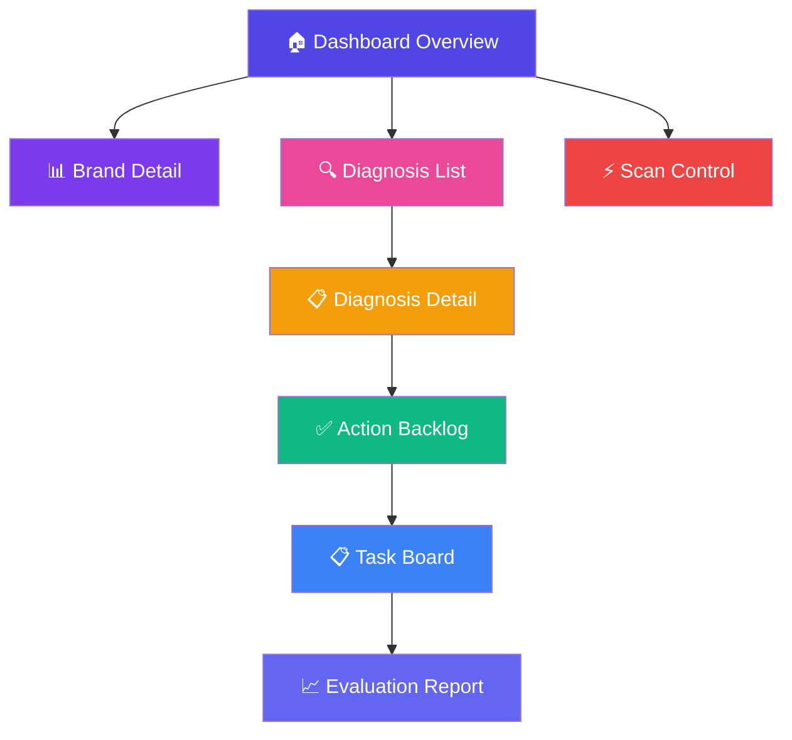
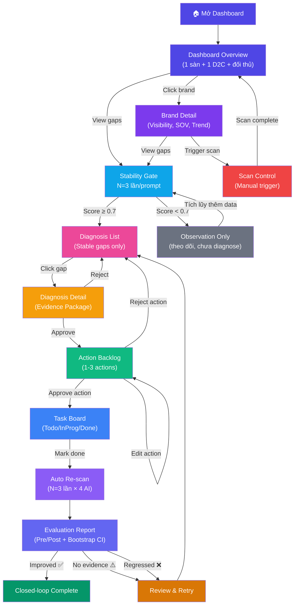

# 🎨 WIREFRAME / UI FLOW — GEO AI Agent cho E-commerce Việt Nam

> **Gate 1 Deliverable** · Ngày 02/08/2026
> **Phụ trách chính:** Hải (Frontend/Infra)
> **Tech Stack:** Next.js 14 + Tailwind CSS + Recharts

---

## MỤC LỤC

1. [Tổng quan Navigation](#1-tổng-quan-navigation)
2. [Sitemap](#2-sitemap)
3. [UI Flow Diagram](#3-ui-flow-diagram)
4. [Screen 1: Dashboard Overview](#4-screen-1-dashboard-overview)
5. [Screen 2: Brand Detail](#5-screen-2-brand-detail)
6. [Screen 3: Diagnosis List](#6-screen-3-diagnosis-list)
7. [Screen 4: Diagnosis Detail](#7-screen-4-diagnosis-detail)
8. [Screen 5: Action Backlog / Task Board](#8-screen-5-action-backlog--task-board)
9. [Screen 6: Evaluation Report](#9-screen-6-evaluation-report)
10. [Screen 7: Scan Control](#10-screen-7-scan-control)
11. [Responsive Design](#11-responsive-design)
12. [Design System](#12-design-system)
13. [User Flow Scenarios](#13-user-flow-scenarios)

---

## 1. Tổng quan Navigation

### 1.1. Top Navigation Bar

```
┌──────────────────────────────────────────────────────────────────┐
│  🛒 VN-ECOM-GEO    │ Dashboard │ Diagnosis │ Tasks │ Reports │  │
│                     │           │           │       │         │  │
│                     │           │           │       │    [⚙]  │  │
└──────────────────────────────────────────────────────────────────┘
```

### 1.2. Sidebar (khi mở)

```
┌─────────────────────┐
│ 🛒 VN-ECOM-GEO     │
│                     │
│ 📊 Dashboard        │
│   ├─ Overview       │
│   └─ Brand Detail   │
│                     │
│ 🔍 Diagnosis        │
│   ├─ Gap List       │
│   └─ Detail         │
│                     │
│ ✅ Tasks             │
│   ├─ Backlog        │
│   └─ Board          │
│                     │
│ 📈 Reports          │
│   ├─ Evaluation     │
│   └─ Export PDF     │
│                     │
│ ⚙ Settings          │
│   ├─ Brands         │
│   ├─ Prompts        │
│   └─ Scan Config    │
└─────────────────────┘
```

---

## 2. Sitemap



---

## 3. UI Flow Diagram

### 3.1. Main User Flow



---

## 4. Screen 1: Dashboard Overview

### 4.1. Wireframe

```
┌──────────────────────────────────────────────────────────────────────────────┐
│  🛒 VN-ECOM-GEO Agent         [Dashboard] [Diagnosis] [Tasks] [Reports] [⚙]│
├──────────────────────────────────────────────────────────────────────────────┤
│                                                                              │
│  ┌─ Summary Cards ─────────────────────────────────────────────────────────┐ │
│  │                                                                         │ │
│  │  ┌──────────────┐  ┌──────────────┐  ┌──────────────┐  ┌─────────────┐ │ │
│  │  │ 📊 Brands    │  │ 🎯 Avg       │  │ ⚡ Stable    │  │ 🚨 Alerts  │ │ │
│  │  │  2 target    │  │ Visibility   │  │ Gaps (≥0.7)  │  │    3 new   │ │ │
│  │  │  (1sàn+1D2C) │  │   42.5%      │  │   28/45      │  │ (giá/ship) │ │ │
│  │  │  6 comp.     │  │   ▲ +5.2%    │  │ 17 obs.only  │  │            │ │ │
│  │  └──────────────┘  └──────────────┘  └──────────────┘  └─────────────┘ │ │
│  └─────────────────────────────────────────────────────────────────────────┘ │
│                                                                              │
│  ┌─ Filters ───────────────────────────────────────────────────────────────┐ │
│  │  Brand: [All ▼]   Prompt Group: [All ▼]   AI Engine: [All ▼]   [Scan] │ │
│  └─────────────────────────────────────────────────────────────────────────┘ │
│                                                                              │
│  ┌─ Visibility Rate by Brand ──────────┐  ┌─ SOV by AI Engine ────────────┐ │
│  │                                      │  │                               │ │
│  │   100% ┤                             │  │    ChatGPT  [===█===]         │ │
│  │    80% ┤      ╭──╮                   │  │    Gemini   [==█====]         │ │
│  │    60% ┤  ╭──╮│  │╭──╮              │  │    Claude   [====█==]         │ │
│  │    40% ┤──│  ││  ││  │──╮           │  │    Tavily   [=█=====]         │ │
│  │    20% ┤  │  ││  ││  │  │           │  │                               │ │
│  │     0% ┤──┴──┴┴──┴┴──┴──┴──         │  │  ■ Điện Máy Xanh (sàn)       │ │
│  │        B1  B2  B3  B4  B5  B6       │  │  ■ Samsung Vietnam (D2C)     │ │
│  │        (2 target + 6 đối thủ)       │  │  ■ Đối thủ 1-6               │ │
│  └──────────────────────────────────────┘  └───────────────────────────────┘ │
│                                                                              │
│  ┌─ Visibility Trend (30 ngày) ────────────────────────────────────────────┐ │
│  │                                                                         │ │
│  │   50% ┤         ╭──╮    ╭──────╮                                       │ │
│  │   40% ┤    ╭────╯  ╰────╯      ╰──────── Điện Máy Xanh (sàn TMĐT)     │ │
│  │   30% ┤────╯                                                           │ │
│  │   20% ┤──────────────────────────────────── Samsung Vietnam (D2C)      │ │
│  │   10% ┤                                                                 │ │
│  │       ┴───┬───┬───┬───┬───┬───┬───┬───┬                                │ │
│  │          W1  W2  W3  W4  (tuần)                                        │ │
│  └─────────────────────────────────────────────────────────────────────────┘ │
│                                                                              │
│  ┌─ Prompt × AI Engine Detail Table ───────────────────────────────────────┐ │
│  │                                                                         │ │
│  │  Prompt                  │ ChatGPT │ Gemini │ Claude │ Tavily │ Stab.  │ │
│  │  ────────────────────────┤─────────┤────────┤────────┤────────┤────────│ │
│  │  "shop điện máy uy t..."  │  ✅ 1st  │  ❌     │  ✅ 3rd │  ✅ 2nd │  0.82 │ │
│  │  "tủ lạnh Samsung giá..." │  ❌      │  ✅ 2nd │  ❌     │  ✅ 1st │ ⚠️0.65│ │
│  │  "so sánh A vs B..."    │  ✅ 1st  │  ✅ 1st │  ✅ 2nd │  ✅ 1st │  0.91 │ │
│  │  "brand có lừa đảo?"    │  ⚠️ neg  │  ✅ pos │  ✅ pos │  ✅ pos │  0.74 │ │
│  │  ...                     │         │        │        │        │        │ │
│  │  ⚠️ = Stability < 0.7 → observation_only, chưa vào diagnosis           │ │
│  │                          │         │        │        │ [Xem thêm →]    │ │
│  └─────────────────────────────────────────────────────────────────────────┘ │
└──────────────────────────────────────────────────────────────────────────────┘
```

### 4.2. Thành phần UI

| Component | Mô tả | Data source |
|-----------|-------|-------------|
| **Summary Cards** | 4 KPI cards: Brands tracked, Avg Visibility, Stable gaps, Alerts | `stability_scores`, `mentions` |
| **Filter Bar** | Dropdown: Brand, Prompt Group, AI Engine + Scan button | `brands`, `prompts` |
| **Visibility Bar Chart** | Bar chart so sánh visibility giữa các brand (Recharts) | `stability_scores` |
| **SOV Stacked Bar** | SOV share by AI engine cho mỗi brand | `mentions` |
| **Trend Line Chart** | Visibility trend theo tuần (Line chart) | `stability_scores` |
| **Detail Table** | Prompt × AI Engine matrix, hiển thị mention position + Stability | `responses`, `mentions`, `stability_scores` |

---

## 5. Screen 2: Brand Detail

### 5.1. Wireframe

```
┌──────────────────────────────────────────────────────────────────────────────┐
│  ← Back to Dashboard        Brand Detail: [Điện Máy Xanh — Sàn TMĐT]    [⚙] │
├──────────────────────────────────────────────────────────────────────────────┤
│                                                                              │
│  ┌─ Brand Info ────────────────────────────────────────────────────────────┐ │
│  │  🏷 Điện Máy Xanh  (Loại: Sàn TMĐT)   Ngành: Điện máy / điện tử         │ │
│  │  Shopee: Active  Lazada: Active   Website: Active                       │ │
│  │  Biến thể tên: "Điện Máy Xanh" / "Dien May Xanh" / "DMX" / "ĐMX"       │ │
│  └─────────────────────────────────────────────────────────────────────────┘ │
│                                                                              │
│  ┌─ KPI Cards ─────────────────────────────────────────────────────────────┐ │
│  │  ┌────────────┐ ┌────────────┐ ┌────────────┐ ┌────────────┐          │ │
│  │  │ Visibility │ │ SOV Rank   │ │ Avg Stab.  │ │ Halluci.   │          │ │
│  │  │   42.5%    │ │   #2/6     │ │   0.78     │ │   2 found  │          │ │
│  │  │   ▲ +5.2%  │ │   (top 3)  │ │   ✅ pass  │ │   🚨 alert │          │ │
│  │  └────────────┘ └────────────┘ └────────────┘ └────────────┘          │ │
│  └─────────────────────────────────────────────────────────────────────────┘ │
│                                                                              │
│  ┌─ Visibility by Prompt Group ─────┐  ┌─ Competitor Comparison ──────────┐ │
│  │                                   │  │                                  │ │
│  │   Uy tín    [████████░░] 80%     │  │  Brand         │ Vis. │ SOV │Stab│ │
│  │   Giá       [██████░░░░] 60%     │  │  ───────────────┤──────┤─────┤────│ │
│  │   So sánh   [████░░░░░░] 40%     │  │  Nguyễn Kim     │ 55%  │ #1  │0.85│ │
│  │   Review    [███░░░░░░░] 30%     │  │  Điện Máy Xanh  │ 42%  │ #2  │0.78│ │
│  │   Ship      [██░░░░░░░░] 20%     │  │  FPT Shop       │ 38%  │ #3  │0.72│ │
│  │                                   │  │  PICO           │ 25%  │ #4  │0.68│ │
│  └───────────────────────────────────┘  │  Samsung        │ 20%  │ #5  │0.71│ │
│                                          │  CellphoneS     │ 18%  │ #6  │0.66│ │
│                                          └──────────────────────────────────┘ │
│                                                                              │
│  ┌─ Recent Gaps (Stability ≥ 0.7) ────────────────────────────────────────┐ │
│  │                                                                         │ │
│  │  🔴 "tủ lạnh giá 17.4tr" (AI nói sai, thực tế 14.99tr)   Stab: 0.82 │ │
│  │     → [View Diagnosis]                                                  │ │
│  │                                                                         │ │
│  │  🟡 "ship chậm" (AI nói, thực tế ship nhanh)            Stab: 0.74   │ │
│  │     → [View Diagnosis]                                                  │ │
│  │                                                                         │ │
│  │  🔵 Không được nhắc trong "top 5 shop điện máy uy tín"   Stab: 0.88   │ │
│  │     → [View Diagnosis]                                                  │ │
│  └─────────────────────────────────────────────────────────────────────────┘ │
└──────────────────────────────────────────────────────────────────────────────┘
```

---

## 6. Screen 3: Diagnosis List

### 6.1. Wireframe

```
┌──────────────────────────────────────────────────────────────────────────────┐
│  🔍 Diagnosis List                                                     [⚙] │
├──────────────────────────────────────────────────────────────────────────────┤
│                                                                              │
│  ┌─ Filters ───────────────────────────────────────────────────────────────┐ │
│  │  Brand: [All ▼]  Status: [All ▼]  Claim Type: [All ▼]  Stab: [≥0.7]  │ │
│  └─────────────────────────────────────────────────────────────────────────┘ │
│                                                                              │
│  ┌─ Tabs ──────────────────────────────────────────────────────────────────┐ │
│  │  [Pending Review (5)] [Approved (12)] [Rejected (3)] [Observation (8)] │ │
│  └─────────────────────────────────────────────────────────────────────────┘ │
│                                                                              │
│  ┌─ Gap Cards ─────────────────────────────────────────────────────────────┐ │
│  │                                                                         │ │
│  │  ┌──────────────────────────────────────────────────────────────────┐   │ │
│  │  │ 🔴 HALLUCINATION — Giá                    Stability: 0.82  ██▓  │   │ │
│  │  │ Brand: Điện Máy Xanh                                            │   │ │
│  │  │ Prompt: "tủ lạnh Samsung Inverter 360L giá bao nhiêu?"         │   │ │
│  │  │ AI nói: 17,400,000đ   Thực tế: 14,990,000đ   Sai: +2,41 triệu │   │ │
│  │  │ AI Engines: ChatGPT ❌ | Gemini ❌ | Claude ✅ | Tavily ✅       │   │ │
│  │  │ Status: ⏳ Pending Review                                       │   │ │
│  │  │                                    [View Detail →] [Approve ✅]  │   │ │
│  │  └──────────────────────────────────────────────────────────────────┘   │ │
│  │                                                                         │ │
│  │  ┌──────────────────────────────────────────────────────────────────┐   │ │
│  │  │ 🟡 MISSING MENTION — Uy tín                Stability: 0.91  ██▓│   │ │
│  │  │ Brand: Điện Máy Xanh                                            │   │ │
│  │  │ Prompt: "top 5 hệ thống điện máy uy tín Việt Nam 2026?"        │   │ │
│  │  │ Brand KHÔNG được nhắc ở 3/4 AI engines                        │   │ │
│  │  │ Đối thủ nhắc: Nguyễn Kim (#1), FPT Shop (#2), PICO (#3)       │   │ │
│  │  │ Status: ⏳ Pending Review                                       │   │ │
│  │  │                                    [View Detail →] [Approve ✅]  │   │ │
│  │  └──────────────────────────────────────────────────────────────────┘   │ │
│  │                                                                         │ │
│  │  ┌──────────────────────────────────────────────────────────────────┐   │ │
│  │  │ 🔵 NEGATIVE SENTIMENT — Ship            Stability: 0.74  ██░   │   │ │
│  │  │ Brand: Điện Máy Xanh                                            │   │ │
│  │  │ Prompt: "Điện Máy Xanh ship có nhanh không?"                   │   │ │
│  │  │ AI nói: "giao hàng có thể chậm 5-7 ngày"                      │   │ │
│  │  │ Thực tế: "nội thành HCM/HN 2-5 ngày, siêu tốc trong ngày"    │   │ │
│  │  │ Status: ⏳ Pending Review                                       │   │ │
│  │  │                                    [View Detail →] [Approve ✅]  │   │ │
│  │  └──────────────────────────────────────────────────────────────────┘   │ │
│  └─────────────────────────────────────────────────────────────────────────┘ │
│                                                                              │
│  [← Prev]  Page 1 of 3  [Next →]                                           │
└──────────────────────────────────────────────────────────────────────────────┘
```

---

## 7. Screen 4: Diagnosis Detail

### 7.1. Wireframe

```
┌──────────────────────────────────────────────────────────────────────────────┐
│  ← Back to Diagnosis List     Diagnosis Detail #DG-001                 [⚙] │
├──────────────────────────────────────────────────────────────────────────────┤
│                                                                              │
│  ┌─ Header ────────────────────────────────────────────────────────────────┐ │
│  │  🔴 HALLUCINATION — Giá sản phẩm                                      │ │
│  │  Brand: Điện Máy Xanh │ Stability: 0.82 ██▓   │   Status: Pending    │ │
│  │  Prompt: "tủ lạnh Samsung Inverter 360L giá bao nhiêu?"              │ │
│  └─────────────────────────────────────────────────────────────────────────┘ │
│                                                                              │
│  ┌─ 3 Responses (Run 1, 2, 3) ────────────────────────────────────────────┐ │
│  │                                                                         │ │
│  │  [Run 1] [Run 2] [Run 3]                                              │ │
│  │                                                                         │ │
│  │  ┌─ ChatGPT (gpt-4o-mini) ─────────────────────────────────────────┐  │ │
│  │  │  "Tủ lạnh Samsung Inverter 360L bán tại Điện Máy Xanh có giá    │  │ │
│  │  │   khoảng ██17,400,000đ██, thuộc phân khúc tầm trung-cao.        │  │ │
│  │  │   So với Samsung.com giá niêm yết cũng tương tự..."             │  │ │
│  │  │  🔴 Claim: giá = 17,400,000đ   Thực tế: 14,990,000đ           │  │ │
│  │  └──────────────────────────────────────────────────────────────────┘  │ │
│  │                                                                         │ │
│  │  ┌─ Gemini ────────────────────────────────────────────────────────┐   │ │
│  │  │  "Giá tủ lạnh Samsung Inverter 360L tại Điện Máy Xanh dao       │   │ │
│  │  │   động từ ██14,900,000đ đến 15,500,000đ██ tùy khuyến mãi..."   │   │ │
│  │  │  ⚠️ Claim: giá = 14,900,000-15,500,000đ   Gần đúng             │   │ │
│  │  └──────────────────────────────────────────────────────────────────┘  │ │
│  │                                                                         │ │
│  │  ┌─ Claude ────────────────────────────────────────────────────────┐   │ │
│  │  │  "Tủ lạnh Samsung Inverter 360L tại Điện Máy Xanh giá           │   │ │
│  │  │   ██14,990,000đ██ theo bảng giá chính hãng."                    │   │ │
│  │  │  ✅ Claim: giá = 14,990,000đ   Chính xác                        │   │ │
│  │  └──────────────────────────────────────────────────────────────────┘  │ │
│  │                                                                         │ │
│  │  ┌─ Tavily (web-grounded) ─────────────────────────────────────────┐  │ │
│  │  │  Sources: shopee.vn/dienmayxanh_official, dienmayxanh.com       │  │ │
│  │  │  "Giá niêm yết: ██14,990,000đ██"                               │  │ │
│  │  │  ✅ Verified: Giá đúng 14,990,000đ                              │  │ │
│  │  └──────────────────────────────────────────────────────────────────┘  │ │
│  └─────────────────────────────────────────────────────────────────────────┘ │
│                                                                              │
│  ┌─ Evidence Package ──────────────────────────────────────────────────────┐ │
│  │                                                                         │ │
│  │  📎 Citation URLs:                                                     │ │
│  │     • https://shopee.vn/dienmayxanh_official (Shopee listing) [Open ↗] │ │
│  │     • https://www.dienmayxanh.com/tu-lanh (Website chính hãng)[Open ↗] │ │
│  │                                                                         │ │
│  │  📝 Quote:                                                              │ │
│  │     "Giá niêm yết tủ lạnh Samsung Inverter 360L: 14,990,000đ"        │ │
│  │                                                                         │ │
│  │  🏷 Claim Type: price                                                   │ │
│  │  📊 Confidence: 0.92                                                    │ │
│  │  📅 Verified at: 02/08/2026 14:30                                       │ │
│  │                                                                         │ │
│  │  ⚡ Tavily Cross-check Result:                                          │ │
│  │     Giá Shopee: 14,990,000đ ✅                                          │ │
│  │     Giá Website: 14,990,000đ ✅                                         │ │
│  │     ChatGPT nói: 17,400,000đ ❌ (sai +2,41 triệu, ~16%)               │ │
│  └─────────────────────────────────────────────────────────────────────────┘ │
│                                                                              │
│  ┌─ Hypothesis & Actions ──────────────────────────────────────────────────┐ │
│  │                                                                         │ │
│  │  💡 Hypothesis (confidence: 0.85):                                      │ │
│  │     "ChatGPT tham chiếu nguồn cũ (trước 01/2026) khi giá còn         │ │
│  │      17,400,000đ. Website dienmayxanh.com thiếu structured data        │ │
│  │      (schema.org Product) nên AI không cập nhật giá mới."               │ │
│  │                                                                         │ │
│  │  📋 Recommended Actions:                                                │ │
│  │     1. [listing_update] Cập nhật schema Product với giá 14,990,000đ    │ │
│  │     2. [content_add] Thêm FAQ "giá tủ lạnh" trên website               │ │
│  │     3. [outreach] Cập nhật thông tin trên Tinhte review                │ │
│  │                                                                         │ │
│  └─────────────────────────────────────────────────────────────────────────┘ │
│                                                                              │
│  ┌─ Actions ───────────────────────────────────────────────────────────────┐ │
│  │                                                                         │ │
│  │    [✅ Approve Diagnosis]    [✏️ Edit]    [❌ Reject]                     │ │
│  │                                                                         │ │
│  └─────────────────────────────────────────────────────────────────────────┘ │
└──────────────────────────────────────────────────────────────────────────────┘
```

---

## 8. Screen 5: Action Backlog / Task Board

### 8.1. Kanban Board Wireframe

```
┌──────────────────────────────────────────────────────────────────────────────┐
│  ✅ Task Board                    Brand: [All ▼]    Status: [All ▼]    [⚙] │
├──────────────────────────────────────────────────────────────────────────────┤
│                                                                              │
│  ┌── TODO ──────────┐  ┌── IN PROGRESS ─────┐  ┌── DONE ───────────────┐   │
│  │                   │  │                     │  │                       │   │
│  │ ┌───────────────┐ │  │ ┌─────────────────┐ │  │ ┌───────────────────┐ │   │
│  │ │ 📝 Schema Add │ │  │ │ 📝 Listing Upd. │ │  │ │ 📝 Content Add   │ │   │
│  │ │ Điện Máy Xanh │ │  │ │ Điện Máy Xanh   │ │  │ │ Điện Máy Xanh    │ │   │
│  │ │ Thêm FAQ giá  │ │  │ │ Schema Product  │ │  │ │ FAQ shipping     │ │   │
│  │ │ ───────────── │ │  │ │ ─────────────── │ │  │ │ ───────────────  │ │   │
│  │ │ Owner: Content│ │  │ │ Owner: Dev team │ │  │ │ Owner: Content   │ │   │
│  │ │ Evidence: 🔗  │ │  │ │ Evidence: 🔗   │ │  │ │ Result: ⏳       │ │   │
│  │ │ [Edit] [→]    │ │  │ │ [Edit] [→]     │ │  │ │ Re-scanning...   │ │   │
│  │ └───────────────┘ │  │ └─────────────────┘ │  │ └───────────────────┘ │   │
│  │                   │  │                     │  │                       │   │
│  │ ┌───────────────┐ │  │                     │  │ ┌───────────────────┐ │   │
│  │ │ 📝 Outreach   │ │  │                     │  │ │ 📝 Content PR    │ │   │
│  │ │ Samsung VN    │ │  │                     │  │ │ Điện Máy Xanh    │ │   │
│  │ │ Update Tinhte │ │  │                     │  │ │ Bài review       │ │   │
│  │ │ ───────────── │ │  │                     │  │ │ ───────────────  │ │   │
│  │ │ Owner: PR     │ │  │                     │  │ │ Result:          │ │   │
│  │ │ Evidence: 🔗  │ │  │                     │  │ │ ✅ Improved      │ │   │
│  │ │ [Edit] [→]    │ │  │                     │  │ │ CI: [12%, 28%]   │ │   │
│  │ └───────────────┘ │  │                     │  │ └───────────────────┘ │   │
│  │                   │  │                     │  │                       │   │
│  │  3 tasks          │  │  1 task              │  │  2 tasks              │   │
│  └───────────────────┘  └─────────────────────┘  └───────────────────────┘   │
│                                                                              │
│  ┌─ Alert Bar ─────────────────────────────────────────────────────────────┐ │
│  │  🚨 Hallucination Alert: ChatGPT nói Điện Máy Xanh ship chậm 5-7 ngày│ │
│  │     (thực tế: 2-5 ngày). Severity: HIGH   [View →]  [Dismiss]        │ │
│  └─────────────────────────────────────────────────────────────────────────┘ │
└──────────────────────────────────────────────────────────────────────────────┘
```

---

## 9. Screen 6: Evaluation Report

### 9.1. Wireframe

```
┌──────────────────────────────────────────────────────────────────────────────┐
│  📈 Evaluation Report — Task #T-003                          [Export PDF]   │
├──────────────────────────────────────────────────────────────────────────────┤
│                                                                              │
│  ┌─ Task Summary ──────────────────────────────────────────────────────────┐ │
│  │  Brand: Điện Máy Xanh                                                   │ │
│  │  Action: Content Add — FAQ về giá tủ lạnh Samsung Inverter 360L        │ │
│  │  Completed: 28/07/2026                                                  │ │
│  │  Re-scanned: 30/07/2026 (3 lần × 4 AI)                                │ │
│  └─────────────────────────────────────────────────────────────────────────┘ │
│                                                                              │
│  ┌─ Verdict ───────────────────────────────────────────────────────────────┐ │
│  │                                                                         │ │
│  │         ┌─────────────────────────────────────────────┐                 │ │
│  │         │                                             │                 │ │
│  │         │    ✅  IMPROVED SIGNAL                       │                 │ │
│  │         │                                             │                 │ │
│  │         │    Visibility tăng +18.5 điểm %             │                 │ │
│  │         │    (vượt noise floor 5-7%)                   │                 │ │
│  │         │                                             │                 │ │
│  │         │    Bootstrap 95% CI: [+12.3%, +24.7%]       │                 │ │
│  │         │                                             │                 │ │
│  │         └─────────────────────────────────────────────┘                 │ │
│  └─────────────────────────────────────────────────────────────────────────┘ │
│                                                                              │
│  ┌─ Pre/Post Comparison ───────────────────────────────────────────────────┐ │
│  │                                                                         │ │
│  │   Visibility Rate                                                       │ │
│  │                                                                         │ │
│  │   60% ┤                    ┌──────┐                                     │ │
│  │   50% ┤                    │ POST │                                     │ │
│  │   40% ┤    ┌──────┐        │      │                                     │ │
│  │   30% ┤    │ PRE  │        │      │                                     │ │
│  │   20% ┤    │      │        │      │                                     │ │
│  │   10% ┤    │      │        │      │                                     │ │
│  │    0% ┤────┴──────┴────────┴──────┴────                                 │ │
│  │         Before (30%)       After (48.5%)                                │ │
│  │                                                                         │ │
│  │   Difference: +18.5 điểm %                                             │ │
│  │                                                                         │ │
│  └─────────────────────────────────────────────────────────────────────────┘ │
│                                                                              │
│  ┌─ Bootstrap 95% CI ─────────────────────────────────────────────────────┐ │
│  │                                                                         │ │
│  │   Noise Floor (5-7%)                                                    │ │
│  │   ─ ─ ─ ─ ─ ─ ─│─ ─ ─ ─ ─ ─ ─ ─ ─ ─ ─ ─ ─ ─ ─                      │ │
│  │                  │                                                      │ │
│  │   0%   5%   10%  │  15%   20%   25%   30%                              │ │
│  │   ├────┤────┤────┤────┤────┤────┤────┤                                  │ │
│  │                  ├─────[████████████]─────┤                             │ │
│  │                  12.3%               24.7%                              │ │
│  │                        18.5%                                            │ │
│  │                     (point estimate)                                    │ │
│  │                                                                         │ │
│  │   ✅ CI hoàn toàn vượt noise floor → Improved Signal                    │ │
│  │                                                                         │ │
│  └─────────────────────────────────────────────────────────────────────────┘ │
│                                                                              │
│  ┌─ Per AI Engine Breakdown ───────────────────────────────────────────────┐ │
│  │                                                                         │ │
│  │   AI Engine │ Pre Vis. │ Post Vis. │ Change  │ Verdict                  │ │
│  │   ──────────┤──────────┤───────────┤─────────┤──────────                │ │
│  │   ChatGPT   │  33%     │  67%      │ +34%    │ ✅ Improved              │ │
│  │   Gemini    │  33%     │  50%      │ +17%    │ ✅ Improved              │ │
│  │   Claude    │  33%     │  50%      │ +17%    │ ✅ Improved              │ │
│  │   Tavily    │  17%     │  33%      │ +16%    │ ✅ Improved              │ │
│  │                                                                         │ │
│  └─────────────────────────────────────────────────────────────────────────┘ │
│                                                                              │
│  ┌─ Brand Comparison ─────────────────────────────────────────────────────┐ │
│  │                                                                         │ │
│  │  ┌─ Điện Máy Xanh ──────────────┐  ┌─ Samsung Vietnam ────────────┐   │ │
│  │  │  Tasks completed: 3          │  │  Tasks completed: 2          │   │ │
│  │  │  Improved: 2                 │  │  Improved: 1                 │   │ │
│  │  │  No evidence: 1              │  │  No evidence: 1              │   │ │
│  │  │  Regressed: 0                │  │  Regressed: 0                │   │ │
│  │  │  Avg. improvement: +15.2%    │  │  Avg. improvement: +8.7%     │   │ │
│  │  └──────────────────────────────┘  └──────────────────────────────┘   │ │
│  └─────────────────────────────────────────────────────────────────────────┘ │
└──────────────────────────────────────────────────────────────────────────────┘
```

---

## 10. Screen 7: Scan Control

### 10.1. Wireframe

```
┌──────────────────────────────────────────────────────────────────────────────┐
│  ⚡ Scan Control                                                       [⚙] │
├──────────────────────────────────────────────────────────────────────────────┤
│                                                                              │
│  ┌─ Manual Scan ───────────────────────────────────────────────────────────┐ │
│  │                                                                         │ │
│  │  Brand:           [Điện Máy Xanh (sàn) ▼]                              │ │
│  │  Prompt Group:    [All ▼]   (~100 prompt tiếng Việt, 5 nhóm)           │ │
│  │  AI Engines:      ☑ ChatGPT  ☑ Gemini  ☑ Claude  ☑ Tavily            │ │
│  │  Runs per prompt: [3 ▼]  ← N=3 lần/prompt (demo); N=7-8 (production)  │ │
│  │                                                                         │ │
│  │  Est. prompts: 100  │  Est. API calls: 1,200  │  Est. cost: ≤$0.30    │ │
│  │                  (100 prompt × N=3 lần × 4 AI engines)                 │ │
│  │                                                                         │ │
│  │                              [🚀 Start Scan]                            │ │
│  └─────────────────────────────────────────────────────────────────────────┘ │
│                                                                              │
│  ┌─ Scan History ──────────────────────────────────────────────────────────┐ │
│  │                                                                         │ │
│  │  Scan ID │ Brand           │ Time        │ Prompts │ Responses │ Status│ │
│  │  ────────┤─────────────────┤─────────────┤─────────┤───────────┤───────│ │
│  │  SC-005  │ Điện Máy Xanh   │ 02/08 14:30 │ 100     │ 1,200     │✅ Done│ │
│  │  SC-004  │ All brands      │ 01/08 09:00 │ 100     │ 1,200     │✅ Done│ │
│  │  SC-003  │ Samsung Vietnam │ 30/07 14:00 │ 100     │ 1,200     │✅ Done│ │
│  │  SC-002  │ Điện Máy Xanh   │ 28/07 09:00 │ 100     │ 1,180     │⚠️Partial│
│  │                                                                         │ │
│  └─────────────────────────────────────────────────────────────────────────┘ │
│                                                                              │
│  ┌─ Scheduled Scans ──────────────────────────────────────────────────────┐ │
│  │  Chạy 1 lần/ngày — mỗi prompt được chạy N=3 lần/scan (stability)      │ │
│  │                                                                         │ │
│  │  ☑ Daily scan at 09:00  │  Brand: All  │  [Edit]                       │ │
│  │  ☑ Daily scan at 21:00  │  Brand: All  │  [Edit]                       │ │
│  │                                                                         │ │
│  └─────────────────────────────────────────────────────────────────────────┘ │
└──────────────────────────────────────────────────────────────────────────────┘
```

---

## 11. Responsive Design

### 11.1. Breakpoints

| Breakpoint | Width | Layout |
|-----------|-------|--------|
| Mobile | < 768px | Single column, cards stack |
| Tablet | 768-1024px | 2-column grid |
| Desktop | > 1024px | Full dashboard layout |

### 11.2. Mobile Adaptations

- **Navigation**: Bottom tab bar thay sidebar
- **Charts**: Full-width, scroll horizontal nếu cần
- **Tables**: Responsive: ẩn cột không quan trọng, scroll horizontal
- **Cards**: Stack vertical
- **Task Board**: Swipe giữa columns

---

## 12. Design System

### 12.1. Color Palette

| Màu | Hex | Sử dụng |
|-----|-----|---------|
| **Primary** (Indigo) | `#4F46E5` | Buttons, links, active states |
| **Success** (Green) | `#059669` | Improved, positive, approve |
| **Warning** (Amber) | `#D97706` | No evidence, pending, caution |
| **Danger** (Red) | `#DC2626` | Regressed, hallucination, reject |
| **Info** (Blue) | `#2563EB` | Missing mention, information |
| **Background** | `#F9FAFB` | Page background |
| **Surface** | `#FFFFFF` | Card background |
| **Text Primary** | `#111827` | Main text |
| **Text Secondary** | `#6B7280` | Subtitle, description |

### 12.2. Verdict Colors

| Verdict | Color | Icon |
|---------|-------|------|
| **Improved signal** | 🟢 Green (`#059669`) | ✅ |
| **No clear evidence** | 🟡 Amber (`#D97706`) | ⚠️ |
| **Regressed** | 🔴 Red (`#DC2626`) | ❌ |
| **Observation only** | ⚪ Gray (`#6B7280`) | 👁 |

### 12.3. Typography

| Element | Font | Size | Weight |
|---------|------|------|--------|
| H1 (Page title) | Inter | 24px | 700 |
| H2 (Section title) | Inter | 20px | 600 |
| H3 (Card title) | Inter | 16px | 600 |
| Body | Inter | 14px | 400 |
| Caption | Inter | 12px | 400 |
| Mono (data) | JetBrains Mono | 13px | 400 |

### 12.4. Component Library

| Component | Mô tả |
|-----------|-------|
| **KPI Card** | Summary card với icon, value, trend indicator |
| **Gap Card** | Diagnosis summary với severity badge, stability bar |
| **Evidence Panel** | Expandable panel hiển thị citation URL + quote |
| **CI Bar** | Bootstrap confidence interval visualization |
| **Stability Gauge** | Circular gauge 0-1 với threshold line tại 0.7 |
| **SOV Chart** | Stacked bar chart chia theo AI engine |
| **Trend Chart** | Multi-line chart theo thời gian |
| **Task Card** | Draggable card cho kanban board |
| **Alert Banner** | Dismissible banner cho hallucination alert |

---

## 13. User Flow Scenarios

> **Context chung:** Marketer hiện phải mở 4 tab AI riêng rạc, không biết đề xuất nào đáng tin (không có stability score), không có priority ranking có bằng chứng, và không có cách đo lại hiệu quả. 3 scenarios dưới đây minh họa cách hệ thống giải quyết các pain points đó (áp dụng cho Điện Máy Xanh / Samsung Vietnam).

### 13.1. Scenario 1: Phát hiện hallucination giá (Pain point #2 + #5)

> *Vấn đề: ChatGPT và Gemini đưa ra giá khác nhau cho cùng sản phẩm → không biết đề xuất nào đáng tin, không có cơ chế verify.*

```
1. Marketer mở Dashboard → thấy Alert "AI nói sai giá" (Hallucination alert)
2. Click Alert → chuyển đến Diagnosis Detail
3. Xem 3 responses (N=3 lần chạy) → Stability Score 0.82 ≥ 0.7 → gap ổn định
4. Xem Evidence Package: Tavily cross-check → giá thật từ Shopee + website chính hãng
5. Click "Approve" → diagnosis vào Action Backlog
6. Xem 3 actions đề xuất → Approve "listing_update" (schema Product)
7. Task tạo → Kanban Board (Todo)
8. Dev team thêm schema.org/Product với giá chính xác
9. Đánh dấu task "Done" (HITL xác nhận)
10. Hệ thống auto re-scan (N=3 lần × 4 AI) → Evaluation Report
11. Bootstrap 95% CI: [+12%, +24%] — vượt noise floor 5-7%
12. Verdict: "Improved Signal" ✅ → closed-loop complete
```

### 13.2. Scenario 2: Brand không được nhắc đến (Pain point #1 + #4)

> *Vấn đề: Kết quả từ 4 AI phân tán, không có dashboard gộp. Không biết làm gì trước — không có priority ranking có citation.*

```
1. Marketer mở Dashboard → thấy brand không xuất hiện trong SOV chart (4 tab gộp thành 1)
2. Lọc theo prompt group "uy tín" → thấy gap ở prompt "top 5 hệ thống điện máy uy tín"
3. Stability Score = 0.91 ≥ 0.7 → gap ổn định, vào diagnosis
4. Click "View Diagnosis" → xem đối thủ nào được nhắc (Nguyễn Kim #1, FPT Shop #2)
5. Evidence package: thiếu schema.org Organization + Review, thiếu citation từ Tinhte
6. Action có priority + citation URL: "content_pr" + "outreach" (Tinhte review)
7. Marketer approve → tasks vào Board với evidence_url đính kèm
8. Sau 1 tuần → mark Done → Re-scan tự động
9. Bootstrap CI overlap với noise floor → Verdict: "No clear evidence" ⚠️
10. Marketer review (không ép thành Improved) → thêm action mới từ evidence
```

### 13.3. Scenario 3: Đồng bộ kết quả đa-AI trước mùa sale (Pain point #1 + #3)

> *Vấn đề: 4 AI đưa đề xuất khác nhau cho cùng brand, không có bối cảnh ngành VN. Marketer không biết đề xuất nào phù hợp mùa sale.*

```
1. Marketer trigger Manual Scan trước mùa sale (Scan Control)
2. Dashboard gộp kết quả 4 AI (ChatGPT, Gemini, Claude, Tavily) vào 1 nơi
3. Diagnosis: 4 AI đưa prompt về sale khác nhau → Stability Score 0.62 < 0.7
4. Gap được đánh "observation_only" (chưa đủ ổn định để diagnose)
5. Sau 3 ngày tích lũy thêm data → Stability Score lên 0.78 → vào Diagnosis
6. Evidence: AI thiếu context "flash sale" vì website chưa có structured data Sale
7. Action: "listing_update" (thêm schema.org/Offer với Sale start/end date)
8. Trigger Re-scan ngay sau khi deploy → Evaluation Report
9. CI: [+8%, +22%] → vượt noise floor → Verdict: "Improved Signal" ✅
10. Report export PDF gửi CMO với pre/post chart + bootstrap CI
```

---

> 📌 **Ghi chú:** Wireframe này là low-fidelity, sẽ được refine trong quá trình phát triển. Hải phụ trách implementation trong Next.js 14 + Tailwind CSS + Recharts.
